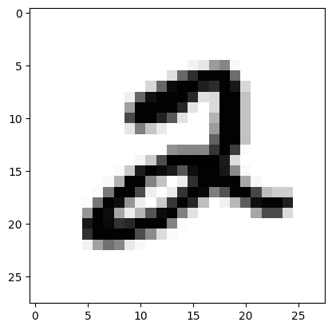
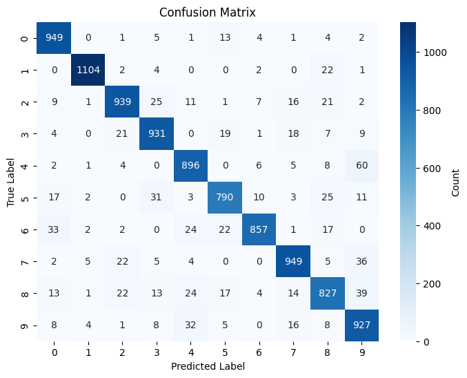

::: {#cell-0 .cell execution_count=1}
``` {.python .cell-code}
# Run this block and make sure it is successful.
import numpy as np  # used for handling mathematical operations easier in python
import tensorflow as tf  # used for creating and training machine learning models 
from tensorflow import keras # Keras contains the mnist dataset
from matplotlib import pyplot as plt  # library that helps us visualize data by creating plots 
import seaborn as sn # visualization library for creating more complex graphs
```

::: {.cell-output .cell-output-stderr}
```
2024-11-26 14:52:48.697917: I tensorflow/core/util/port.cc:153] oneDNN custom operations are on. You may see slightly different numerical results due to floating-point round-off errors from different computation orders. To turn them off, set the environment variable `TF_ENABLE_ONEDNN_OPTS=0`.
2024-11-26 14:52:48.701006: I external/local_xla/xla/tsl/cuda/cudart_stub.cc:32] Could not find cuda drivers on your machine, GPU will not be used.
2024-11-26 14:52:48.706801: I external/local_xla/xla/tsl/cuda/cudart_stub.cc:32] Could not find cuda drivers on your machine, GPU will not be used.
2024-11-26 14:52:48.725745: E external/local_xla/xla/stream_executor/cuda/cuda_fft.cc:477] Unable to register cuFFT factory: Attempting to register factory for plugin cuFFT when one has already been registered
WARNING: All log messages before absl::InitializeLog() is called are written to STDERR
E0000 00:00:1732650768.753111   23389 cuda_dnn.cc:8310] Unable to register cuDNN factory: Attempting to register factory for plugin cuDNN when one has already been registered
E0000 00:00:1732650768.758511   23389 cuda_blas.cc:1418] Unable to register cuBLAS factory: Attempting to register factory for plugin cuBLAS when one has already been registered
2024-11-26 14:52:48.785817: I tensorflow/core/platform/cpu_feature_guard.cc:210] This TensorFlow binary is optimized to use available CPU instructions in performance-critical operations.
To enable the following instructions: AVX2 AVX512F AVX512_VNNI FMA, in other operations, rebuild TensorFlow with the appropriate compiler flags.
```
:::
:::


<!-- WARNING: THIS FILE WAS AUTOGENERATED! DO NOT EDIT! -->

::: {#cell-2 .cell execution_count=2}
``` {.python .cell-code}
(x_train, y_train), (x_test, y_test) = keras.datasets.mnist.load_data()
```

::: {.cell-output .cell-output-stdout}
```
Downloading data from https://storage.googleapis.com/tensorflow/tf-keras-datasets/mnist.npz
11490434/11490434 ━━━━━━━━━━━━━━━━━━━━ 2s 0us/step
```
:::
:::


::: {#cell-3 .cell execution_count=4}
``` {.python .cell-code}
def plotImage(index,x_train,x_test,y_train):
    # Normalize the values so they are a decimal between 0 and 1
    x_train = x_train/255
    x_test = x_test/255
    print(f'The plot represents the number {y_train[index]}')
    plt.imshow(x_train[index],cmap = plt.cm.binary )
    plt.show()


plotImage(5,x_train,x_test,y_train)
```

::: {.cell-output .cell-output-stdout}
```
The plot represents the number 2
```
:::

::: {.cell-output .cell-output-display}
{}
:::
:::


::: {#cell-4 .cell execution_count=6}
``` {.python .cell-code}
x_train_flat = x_train.reshape(len(x_train), 784)
x_test_flat = x_train.reshape(len(x_train), 784)

# x_train_flat = 
# x_test_flat =
```
:::


::: {#cell-5 .cell execution_count=7}
``` {.python .cell-code}
# Model creation
model = keras.Sequential([
    keras.layers.Dense(128, input_shape = (784,),activation='relu'), 
    keras.layers.Dense(64, activation='sigmoid'), 
    keras.layers.Dense(32, activation='sigmoid'), 
    keras.layers.Dense(10, activation='sigmoid')
])
model.compile (
    optimizer='adam',
    loss = 'sparse_categorical_crossentropy',
    metrics = ['accuracy']
)
```

::: {.cell-output .cell-output-stderr}
```
/home/jackson/anaconda3/envs/mlhw/lib/python3.10/site-packages/keras/src/layers/core/dense.py:87: UserWarning: Do not pass an `input_shape`/`input_dim` argument to a layer. When using Sequential models, prefer using an `Input(shape)` object as the first layer in the model instead.
  super().__init__(activity_regularizer=activity_regularizer, **kwargs)
2024-11-26 14:56:48.230635: E external/local_xla/xla/stream_executor/cuda/cuda_driver.cc:152] failed call to cuInit: INTERNAL: CUDA error: Failed call to cuInit: UNKNOWN ERROR (303)
```
:::
:::


::: {#cell-6 .cell execution_count=8}
``` {.python .cell-code}
# TODO: Train the model using model.fit here
model.fit(x_train_flat, y_train, epochs=5)
```

::: {.cell-output .cell-output-stdout}
```
Epoch 1/5
1875/1875 ━━━━━━━━━━━━━━━━━━━━ 7s 3ms/step - accuracy: 0.6943 - loss: 1.1940
Epoch 2/5
1875/1875 ━━━━━━━━━━━━━━━━━━━━ 6s 3ms/step - accuracy: 0.9025 - loss: 0.3416
Epoch 3/5
1875/1875 ━━━━━━━━━━━━━━━━━━━━ 6s 3ms/step - accuracy: 0.9024 - loss: 0.3303
Epoch 4/5
1875/1875 ━━━━━━━━━━━━━━━━━━━━ 7s 4ms/step - accuracy: 0.9141 - loss: 0.2854
Epoch 5/5
1875/1875 ━━━━━━━━━━━━━━━━━━━━ 6s 3ms/step - accuracy: 0.9219 - loss: 0.2705
```
:::

::: {.cell-output .cell-output-display execution_count=8}
```
<keras.src.callbacks.history.History at 0x7ff27c754d00>
```
:::
:::


::: {#cell-7 .cell execution_count=12}
``` {.python .cell-code}
x_test_flat = x_test.reshape(len(x_test), 784)
model.evaluate(x_test_flat, y_test)
```

::: {.cell-output .cell-output-stdout}
```
313/313 ━━━━━━━━━━━━━━━━━━━━ 1s 2ms/step - accuracy: 0.9064 - loss: 0.3217
```
:::

::: {.cell-output .cell-output-display execution_count=12}
```
[0.28415748476982117, 0.9168999791145325]
```
:::
:::


::: {#cell-8 .cell execution_count=13}
``` {.python .cell-code}
# TODO: Run the confusion matrix
def plot_confusion_matrix(model, x_test_flat, y_test):
    # Make predictions
    y_pred = model.predict(x_test_flat)
    y_pred_labels = [np.argmax(i) for i in y_pred]
    # Create confusion matrix
    confusion_matrix = tf.math.confusion_matrix(labels=y_test, predictions=y_pred_labels)
    # Plot the confusion matrix
    plt.figure(figsize=(8, 6))
    sn.heatmap(confusion_matrix, annot=True, fmt='d', cmap='Blues', cbar_kws={'label': 'Count'})
    plt.title('Confusion Matrix')
    plt.xlabel('Predicted Label')
    plt.ylabel('True Label')
    plt.show()

# TODO: Uncomment out the line below and run the code block
plot_confusion_matrix(model,x_test_flat,y_test)
```

::: {.cell-output .cell-output-stdout}
```
313/313 ━━━━━━━━━━━━━━━━━━━━ 1s 2ms/step
```
:::

::: {.cell-output .cell-output-display}
{}
:::
:::


